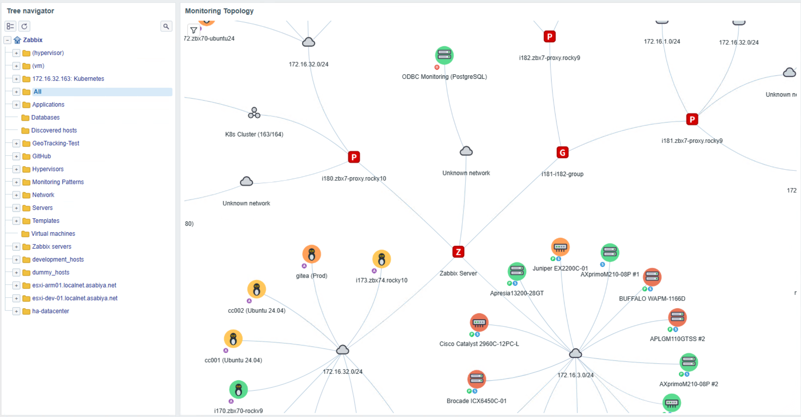
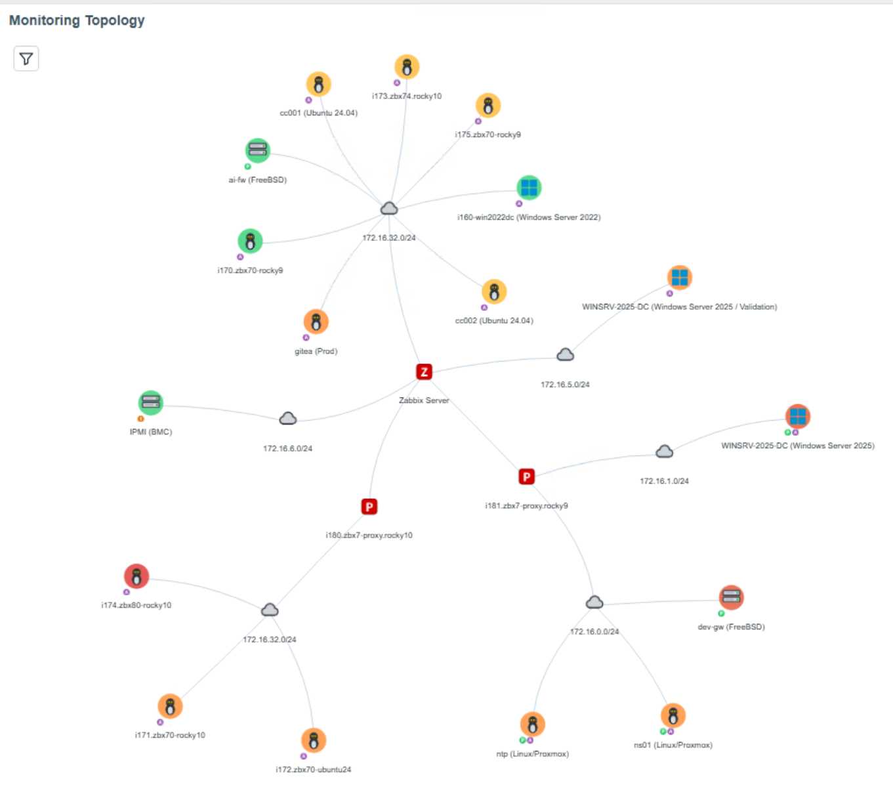
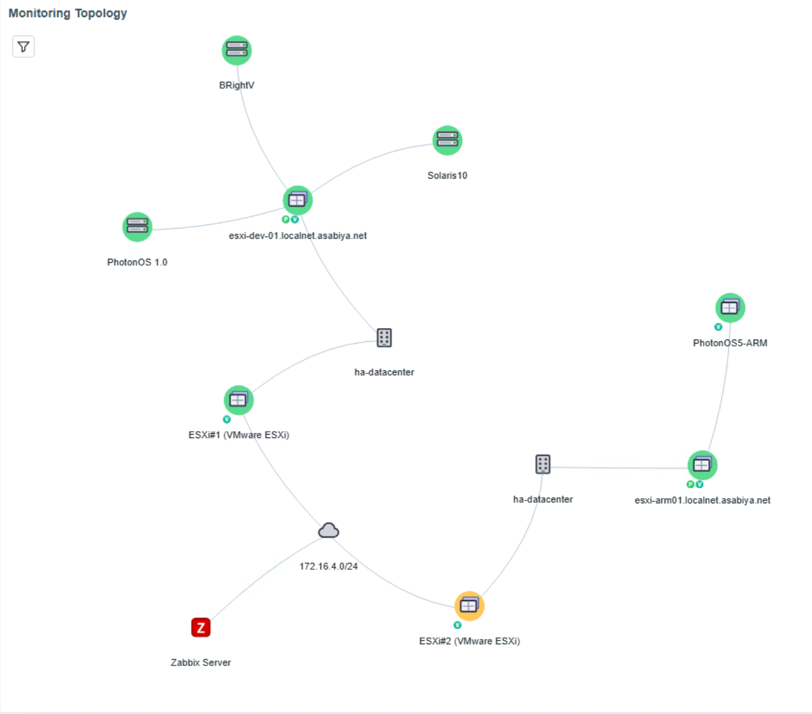
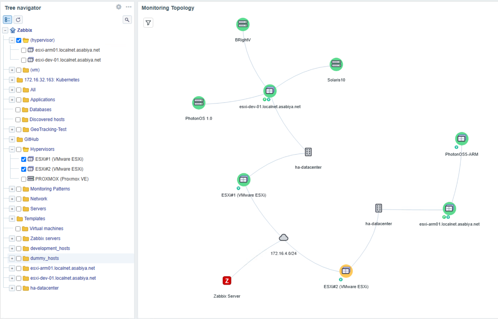
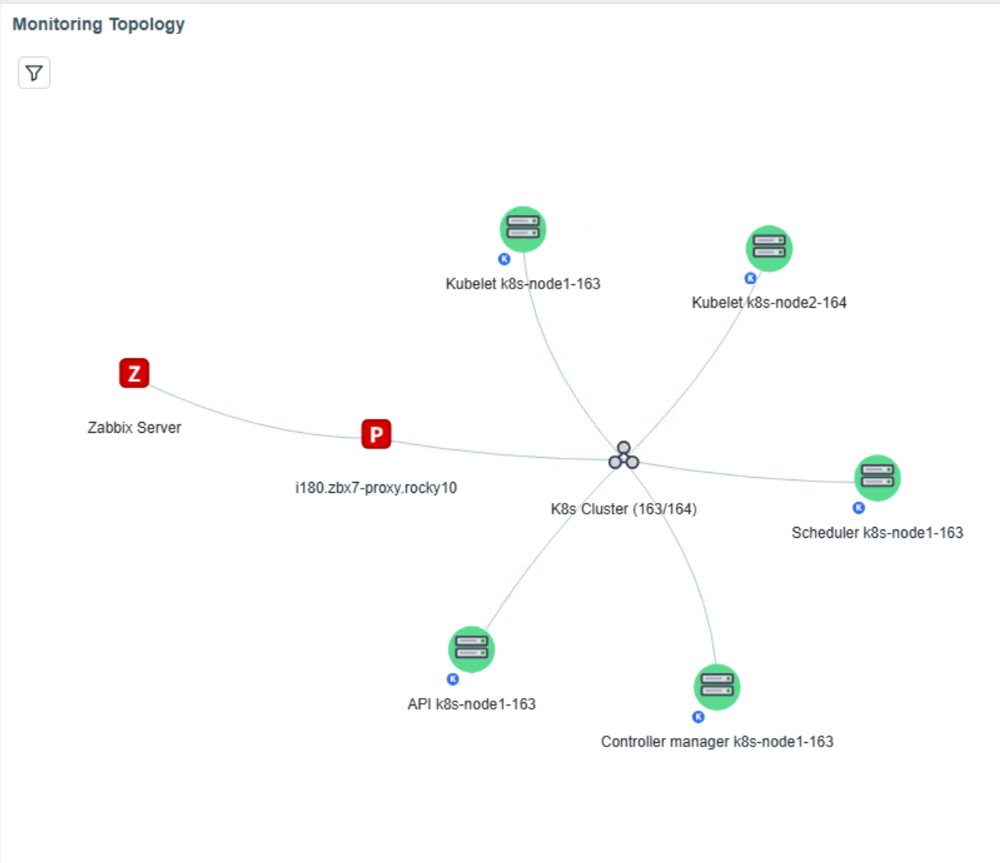
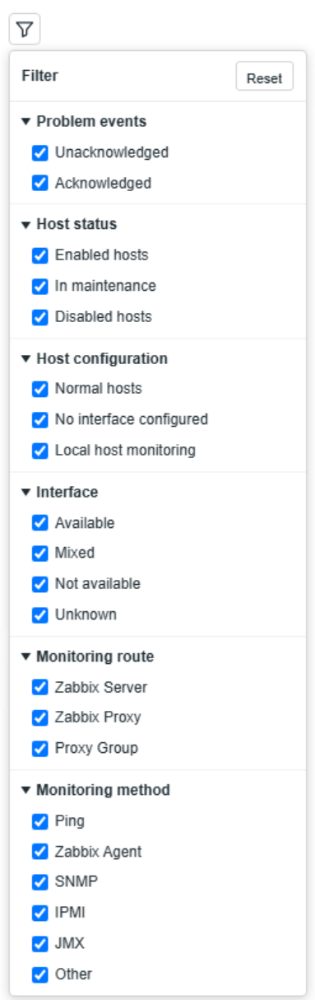
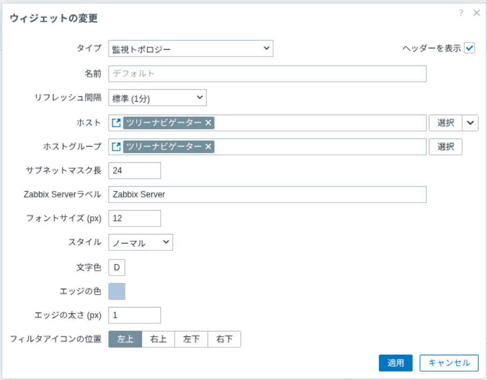

# zabbix-widget-monitoring-topology

[English](README.md) | 日本語

## 概要

Monitoring Topology は、Zabbix Server から Proxy、ネットワーク、仮想化・クラスタ階層、ホストへ至る監視経路を、対話型のトポロジーグラフとして可視化する Zabbix ダッシュボードウィジェットです。

[Tree Navigator](https://github.com/HOLOZTEK/zabbix-widget-tree-navigator) などからホストまたはホストグループの選択を受信し、選択範囲に対応するトポロジーを再描画します。グラフ描画には Vis Network の Canvas2D を使用し、WebGL は不要です。



[最新リリース](https://github.com/HOLOZTEK/zabbix-widget-monitoring-topology/releases/tag/v1.0.6) | [RPM](https://github.com/HOLOZTEK/zabbix-widget-monitoring-topology/releases/download/v1.0.6/zabbix-widget-monitoring-topology-1.0.6.noarch.rpm) | [DEB](https://github.com/HOLOZTEK/zabbix-widget-monitoring-topology/releases/download/v1.0.6/zabbix-widget-monitoring-topology_1.0.6_all.deb) | [Source](https://github.com/HOLOZTEK/zabbix-widget-monitoring-topology/releases/download/v1.0.6/zabbix-widget-monitoring-topology-1.0.6.tar.gz)

## Monitoring Topology を使う理由

通常のダッシュボードではホスト状態を確認できますが、各ホストがどの Server／Proxy から、どの経路で監視されているかを一覧で把握するのは容易ではありません。本ウィジェットは、Zabbix の設定・アイテム・ディスカバリ関係を基に監視経路を可視化します。

Server／Proxy とホストの対応、サブネット別の配置、VMware や Kubernetes の親子関係を運用者が俯瞰したい場合に適しています。

## 機能

| 機能 | 説明 |
| --- | --- |
| 監視経路グラフ | Zabbix Server、Proxy Group、Proxy、Network、Cluster、Datacenter、Host、VM を接続して表示します。 |
| ネットワーク自動算出 | ホスト／Proxy のインターフェースIPと設定可能なIPv4プレフィックス長からNetworkノードを算出します。 |
| VMware階層 | 公式VMwareテンプレートのディスカバリとアイテムから Datacenter / Cluster / ESXi / VM 階層を構成します。 |
| Kubernetesクラスタ | 公式Kubernetesテンプレートのキーを検出し、同じ監視経路上の複数クラスタも個別に表示します。 |
| Proxmox対応 | インターフェースを持たない監視ホストでは接続先マクロからネットワークまたはラベルを決定します。 |
| 機器・監視方式表示 | ホスト種別アイコンと Ping、SNMP、Agent、IPMI、VMware、ODBC、JMX、Kubernetes 等のバッジを表示します。 |
| 運用状態表示 | 応答のないProxyを識別し、障害重要度の色はHostノードだけに適用します。 |
| 対話操作 | 自動レイアウト、ノード移動、ツールチップ、ホスト詳細画面への移動に対応します。 |
| 表示フィルタ | 障害確認状態、ホスト状態、ホスト設定、インターフェース、監視経路、監視方式で絞り込みます。 |
| ウィジェット連携 | Tree Navigator 等からホスト／ホストグループの動的パラメータを受信します。 |
| 表示設定 | ノード文字、エッジ、Serverラベル、サブネット、フィルタボタン位置を設定できます。 |

## 表示例

<table>
  <tr>
    <td align="center" valign="top" width="50%"><strong>監視経路の全体表示</strong><br></td>
    <td align="center" valign="top" width="50%"><strong>仮想化環境の全体表示</strong><br></td>
  </tr>
  <tr>
    <td align="center" valign="top" width="50%"><strong>VMware ESXi 階層</strong><br></td>
    <td align="center" valign="top" width="50%"><strong>Kubernetes クラスタ</strong><br></td>
  </tr>
</table>

## トポロジーモデル

代表的な経路は次のとおりです。

```text
Zabbix Server -> Network -> Host
Zabbix Server -> Proxy Group -> Proxy -> Network -> Host
Zabbix Server/Proxy -> Network -> VMware接続ホスト -> Datacenter -> Cluster -> ESXi -> VM
Zabbix Server/Proxy -> Kubernetes Cluster -> Kubernetesホスト
```

実際の構成はインターフェース、Proxy割り当て、ディスカバリ関係、マクロ、監視アイテムに依存します。障害重要度を集約するのはHostノードだけで、グルーピング用ノードは配下全体の正常性を表しません。

## 表示フィルタ

フィルタパネルから、障害確認状態、ホスト状態、ホスト設定、インターフェース、監視経路、監視方式で表示対象を絞り込めます。カテゴリ間の条件を組み合わせ、大規模なトポロジーから現在調査する範囲だけを表示できます。



## 設定項目

| 項目 | 説明 |
| --- | --- |
| ホスト／ホストグループ | 他ウィジェットと接続する受信専用コネクタです。 |
| サブネットプレフィックス長 | Networkノード算出用のIPv4プレフィックス。既定値は24です。 |
| Zabbix Serverラベル | ルートServerノードに表示する名称です。 |
| フォントサイズ | 8〜24pxのノードラベルサイズです。 |
| スタイル | 通常、太字、斜体から選択します。 |
| フォント色 | 空欄ではライト／ダークテーマを自動判定し、指定時はその色を使用します。 |
| エッジ色 | ノード間を結ぶ線の色です。 |
| エッジ幅 | 1〜8pxの線幅です。 |
| フィルタアイコン位置 | 左上、右上、左下、右下から選択します。 |



## ダッシュボード連携

本ウィジェットは受信専用で、ホストまたはホストグループを受信するまでは空状態を表示します。

1. `_hostid` または `_hostgroupid` を配信する Tree Navigator 等を配置します。
2. 同じページへ Monitoring Topology を追加します。
3. 設定画面でホスト／ホストグループを送信元ウィジェットへ接続します。
4. ホスト選択時はそのホストの経路、ホストグループ選択時はグループ内ホストの経路を表示します。

## 動作要件

- Zabbix 7.0 以上
- パッケージインストールでは PHP 8.3 以上
- Canvas2D 対応ブラウザ

## インストール

### RPM

```bash
rpm -Uvh zabbix-widget-monitoring-topology-1.0.6.noarch.rpm
```

### DEB

```bash
apt install ./zabbix-widget-monitoring-topology_1.0.6_all.deb
```

パッケージは実行ファイルを利用中のZabbixフロントエンドモジュールディレクトリへ配置します。その後、管理 → モジュールで再スキャンして有効化し、ダッシュボードへ追加してください。

### ソースから

通常はRPMまたはDEBを推奨します。ソースから配置する場合:

```bash
curl -L -o zabbix-widget-monitoring-topology-1.0.6.tar.gz https://github.com/HOLOZTEK/zabbix-widget-monitoring-topology/releases/download/v1.0.6/zabbix-widget-monitoring-topology-1.0.6.tar.gz
tar -xzf zabbix-widget-monitoring-topology-1.0.6.tar.gz
install -d /usr/share/zabbix/ui/modules/holoztek_monitoringmap
cd zabbix-widget-monitoring-topology-1.0.6
cp -a manifest.json Module.php Widget.php actions assets includes locale views /usr/share/zabbix/ui/modules/holoztek_monitoringmap/
```

旧パスを使用する環境では `/usr/share/zabbix/modules/holoztek_monitoringmap` に配置します。Zabbixフロントエンドが読める所有者・権限を設定し、モジュールを再スキャンして有効化してください。

## 旧モジュールIDからの移行

v1.0.1でモジュールIDを `monitoringmap` から `holoztek_monitoringmap` に変更しました。パッケージ名は `zabbix-widget-monitoring-topology` のままです。

1. 現行パッケージまたはソースを配置してモジュールを再スキャンします。
2. `holoztek_monitoringmap` を有効化し、残っている旧 `monitoringmap` を無効化します。
3. ダッシュボードをバックアップまたはエクスポートします。
4. `dashboard.get` で全ページ・全ウィジェットを含む完全な構造を取得します。
5. `type` が `monitoringmap` のウィジェットだけを `holoztek_monitoringmap` へ変更し、`widgetid`、`fields`、`reference` は保持します。
6. 完全な `pages` 構造を指定して `dashboard.update` を呼びます。必要に応じてテンプレートダッシュボードにも適用します。

```php
foreach ($dashboard['pages'] as &$page) {
    foreach ($page['widgets'] as &$widget) {
        if ($widget['type'] === 'monitoringmap') {
            $widget['type'] = 'holoztek_monitoringmap';
        }
    }
}
```

パッケージスクリプトは、manifestから本ウィジェット由来と安全に識別できる場合だけ旧ディレクトリを削除します。判定できないディレクトリは手動確認のため残します。

## ドキュメント

- [変更履歴](docs/CHANGELOG.md)
- [コントリビューション](docs/CONTRIBUTING.md)
- [セキュリティ](docs/SECURITY.md)
- [スクリーンショットガイド](docs/screenshot-guide.md)
- [ライセンス](LICENSE)

## リポジトリ構成

実行時ファイルはルートと `actions/`、`assets/`、`includes/`、`locale/`、`views/` に配置しています。パッケージ定義は `packaging/rpm/` と `debian/`、公開・保守文書は `docs/` に分離しています。

## 同梱依存ライブラリ

`assets/js/vis-network.min.js` は Vis Network 10.1.0 です。ファイルヘッダーに記載されたMITまたはApache-2.0ライセンスで配布されています。

## メンテナー

[HOLOZTEK](https://github.com/HOLOZTEK) が開発・保守しています。

## ライセンス

MIT Licenseです。詳細は [LICENSE](LICENSE) を参照してください。
