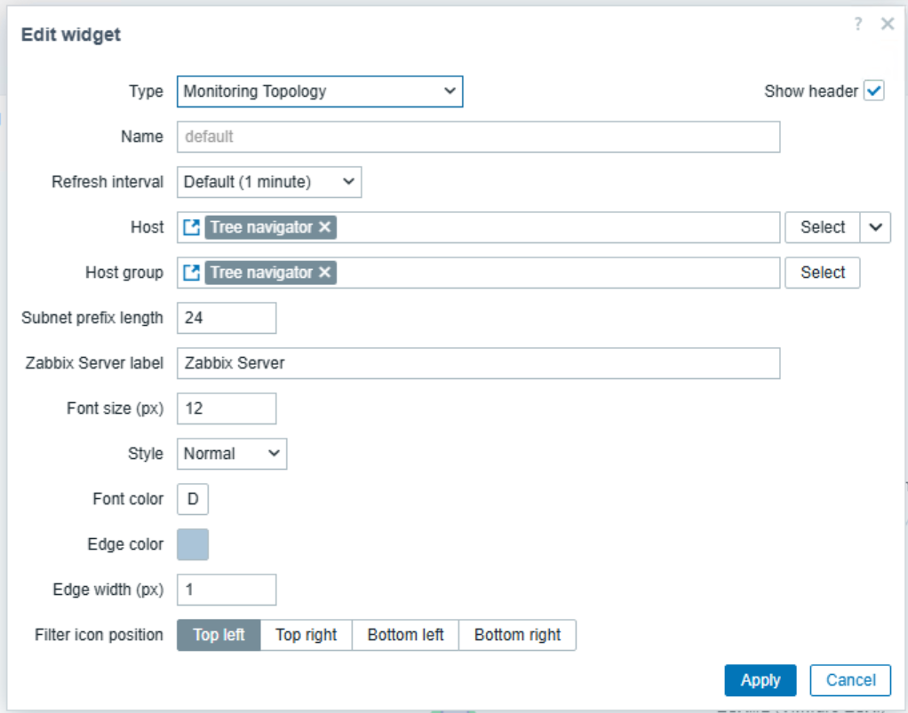

# zabbix-widget-monitoring-topology

English | [日本語](README.ja.md)

## Overview

Monitoring Topology is a Zabbix dashboard widget that visualizes the monitoring path from Zabbix Server through proxy, network, virtualization, cluster, and host layers as an interactive topology graph.

It receives host or host-group selections from another dashboard widget, such as [Tree Navigator](https://github.com/HOLOZTEK/zabbix-widget-tree-navigator), and redraws the topology for the selected scope. Vis Network renders the graph in Canvas2D; WebGL is not required.


[Latest release](https://github.com/HOLOZTEK/zabbix-widget-monitoring-topology/releases/tag/v1.0.6) | [RPM](https://github.com/HOLOZTEK/zabbix-widget-monitoring-topology/releases/download/v1.0.6/zabbix-widget-monitoring-topology-1.0.6.noarch.rpm) | [DEB](https://github.com/HOLOZTEK/zabbix-widget-monitoring-topology/releases/download/v1.0.6/zabbix-widget-monitoring-topology_1.0.6_all.deb) | [Source](https://github.com/HOLOZTEK/zabbix-widget-monitoring-topology/releases/download/v1.0.6/zabbix-widget-monitoring-topology-1.0.6.tar.gz)

## Why Monitoring Topology?

Zabbix dashboards usually show host status, but the monitoring route behind each host can be difficult to understand at a glance. Monitoring Topology exposes that route and groups infrastructure by the relationships detected from Zabbix configuration and item data.

Use it when operators need to see which server or proxy monitors a host, how hosts map to subnets, or how VMware and Kubernetes resources relate to their parent infrastructure.

## Features

| Function | What it does |
| --- | --- |
| Monitoring-path graph | Shows Zabbix Server, Proxy Group, Proxy, Network, Cluster, Datacenter, Host, and VM nodes with connecting edges. |
| Network derivation | Calculates network nodes from host and proxy interface addresses using a configurable IPv4 prefix length. |
| VMware hierarchy | Builds Datacenter / Cluster / ESXi / VM branches from official VMware template discovery and item data. |
| Kubernetes grouping | Detects official Kubernetes template item keys and separates multiple clusters under the same monitoring path. |
| Proxmox handling | Uses the Proxmox endpoint macro to label or derive a network when the monitored host has no Zabbix interface. |
| Device and method indicators | Uses host-type icons and badges for Ping, SNMP, Agent, IPMI, VMware, ODBC, JMX, Kubernetes, and other methods. |
| Operational status | Marks non-responding proxies and applies problem-severity colors to host nodes only. |
| Interactive graph | Supports physics-based layout, node dragging, hover tooltips, and host-detail navigation. |
| Display filters | Filters by problem acknowledgement, host state, host configuration, interface, monitoring route, and monitoring method. |
| Widget integration | Receives host and host-group dynamic parameters from Tree Navigator or another compatible widget. |
| Theme controls | Configures node font, edge appearance, server label, subnet prefix, and filter-button position. |

## Topology Models

Monitoring Topology derives the graph from proxy assignments, interfaces, discovery relationships, macros, and monitoring items. The main model patterns are:

| Pattern | Detection method and typical path | Reference image |
| --- | --- | --- |
| Zabbix Server route | **Typical path:** `Zabbix Server -> Network -> Host`<br>The host is monitored directly by Zabbix Server. Its primary interface and configured subnet prefix determine the Network node. |  |
| Zabbix Proxy route | **Typical path:** `Zabbix Server -> Zabbix Proxy -> Network -> Host`<br>A host assigned to a standalone Zabbix Proxy is placed below that Proxy and its derived Network node. |  |
| Proxy Group route | **Typical path:** `Zabbix Server -> Proxy Group -> Zabbix Proxy -> Network -> Host`<br>A host monitored through a Proxy Group is placed below the group and the member Proxy used for its route. |  |
| VMware monitoring | **Typical path:** `Server/Proxy -> Network -> VMware connection host -> Datacenter -> Cluster -> ESXi -> VM`<br>Official VMware template discovery and `vmware.hv.*` item data provide the connection host, inventory hierarchy, and VM-to-ESXi relationship. | <br> |
| Kubernetes monitoring | **Typical path:** `Server/Proxy -> Kubernetes Cluster -> Kubernetes hosts`<br>Official Kubernetes template item keys and discovery parents identify each cluster and keep multiple clusters on the same route separate. |  |

The exact structure depends on the data available in Zabbix. Only Host nodes carry problem-severity coloring; Server, Proxy Group, Proxy, Network, Datacenter, and Cluster nodes do not represent aggregated health.

## Display Filters

The filter panel limits which Host nodes remain visible. Within one category, selected values are combined with OR; the six categories are combined with AND. Parent infrastructure nodes and edges disappear automatically when none of their descendant hosts remain visible.

| Category | Choices | Purpose and default |
| --- | --- | --- |
| Problem events | Unacknowledged, Acknowledged | Controls which problem severities contribute to host coloring rather than host visibility. Both are enabled by default; clearing both removes problem coloring. |
| Host status | Enabled hosts, In maintenance, Disabled hosts | Includes hosts by operational state. Only Enabled hosts is selected by default. |
| Host configuration | Normal hosts, No interface configured, Local host monitoring | Includes ordinary interface-based hosts, interface-less hosts, or locally monitored hosts. Only Normal hosts is selected by default. |
| Interface | Available, Mixed, Not available, Unknown | Includes hosts by interface availability. All choices are enabled by default. |
| Monitoring route | Zabbix Server, Zabbix Proxy, Proxy Group | Includes hosts by their upstream monitoring route. All choices are enabled by default. |
| Monitoring method | Ping, Zabbix Agent, SNMP, IPMI, JMX, Other | Includes hosts by detected monitoring method. All choices are enabled by default. Other includes VMware, ODBC, Kubernetes, and methods that cannot be classified separately. |

Except for Problem events, clearing every choice in a category hides every host. Filter state is saved per widget in the browser, and Reset restores the defaults above.


## Settings

| Setting | Description |
| --- | --- |
| Host / Host group | Receive-only connectors used to link another dashboard widget. |
| Subnet prefix length | IPv4 prefix used to derive network nodes; default is 24. |
| Zabbix Server label | Label displayed for the root server node. |
| Font size | Node-label size from 8 to 24 pixels. |
| Style | Normal, bold, or italic node labels. |
| Font color | Explicit node-label color; empty uses automatic light/dark theme detection. |
| Edge color | Color of graph edges. |
| Edge width | Edge width from 1 to 8 pixels. |
| Filter icon position | Top-left, top-right, bottom-left, or bottom-right. |



## Dashboard Integration

This widget is receive-only and intentionally shows an empty state until a host or host group is received.

1. Add Tree Navigator or another widget that broadcasts `_hostid` or `_hostgroupid`.
2. Add Monitoring Topology to the same dashboard page.
3. In Monitoring Topology settings, connect Host and/or Host group to the source widget.
4. Select a host to show its route, or a host group to show routes for hosts in that group.

## Requirements

- Zabbix 7.0 or later
- PHP 8.3 or later for packaged installation
- Browser with Canvas2D support

## Installation

### Install from RPM

```bash
rpm -Uvh zabbix-widget-monitoring-topology-1.0.6.noarch.rpm
```

### Install from DEB

```bash
apt install ./zabbix-widget-monitoring-topology_1.0.6_all.deb
```

The packages install the runtime files into the active Zabbix frontend module directory. Then scan and enable the module from Administration -> Modules and add the widget to a dashboard.

### Install from Source

RPM or DEB installation is recommended. For a source installation:

```bash
curl -L -o zabbix-widget-monitoring-topology-1.0.6.tar.gz https://github.com/HOLOZTEK/zabbix-widget-monitoring-topology/releases/download/v1.0.6/zabbix-widget-monitoring-topology-1.0.6.tar.gz
tar -xzf zabbix-widget-monitoring-topology-1.0.6.tar.gz
install -d /usr/share/zabbix/ui/modules/holoztek_monitoringmap
cd zabbix-widget-monitoring-topology-1.0.6
cp -a manifest.json Module.php Widget.php actions assets includes locale views /usr/share/zabbix/ui/modules/holoztek_monitoringmap/
```

Use `/usr/share/zabbix/modules/holoztek_monitoringmap` if the installation uses the legacy frontend module path. Set readable ownership and permissions, scan modules, and enable Monitoring Topology.

## Upgrading from the Old Module ID

Version 1.0.1 changed the module ID from `monitoringmap` to `holoztek_monitoringmap` to avoid vendor collisions. The package name remains `zabbix-widget-monitoring-topology`.

1. Install the current package or source files and rescan modules.
2. Enable `holoztek_monitoringmap` and disable the old `monitoringmap` entry if it remains.
3. Back up or export the dashboard.
4. Retrieve the complete dashboard, including all pages and widgets, with `dashboard.get`.
5. Change only widget entries whose `type` is `monitoringmap` to `holoztek_monitoringmap`; preserve `widgetid`, `fields`, and `reference`.
6. Call `dashboard.update` with the complete `pages` structure. Apply the same migration to template dashboards when applicable.

```php
foreach ($dashboard['pages'] as &$page) {
    foreach ($page['widgets'] as &$widget) {
        if ($widget['type'] === 'monitoringmap') {
            $widget['type'] = 'holoztek_monitoringmap';
        }
    }
}
```

Package scripts remove the old module directory only when its manifest can be safely identified as this HOLOZTEK widget. Ambiguous directories are left in place for manual inspection.

## Documentation

- [CHANGELOG](docs/CHANGELOG.md)
- [CONTRIBUTING](docs/CONTRIBUTING.md)
- [SECURITY](docs/SECURITY.md)
- [Screenshot Guide](docs/screenshot-guide.md)
- [LICENSE](LICENSE)

## Repository Layout

Runtime module files remain in the repository root and under `actions/`, `assets/`, `includes/`, `locale/`, and `views/`. Packaging is under `packaging/rpm/` and `debian/`; publication and maintenance documents are under `docs/`.

## Bundled Dependency

`assets/js/vis-network.min.js` is Vis Network 10.1.0, distributed under the MIT or Apache-2.0 license as stated in its source header.

## Maintainer

Developed and maintained by [HOLOZTEK](https://github.com/HOLOZTEK).

## License

This project is licensed under the MIT License. See [LICENSE](LICENSE).
