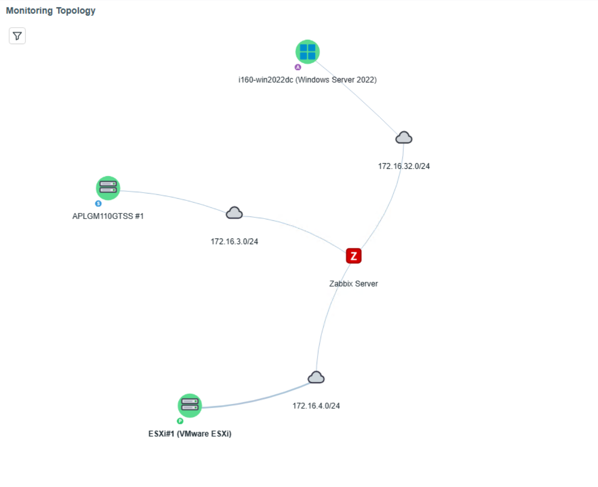
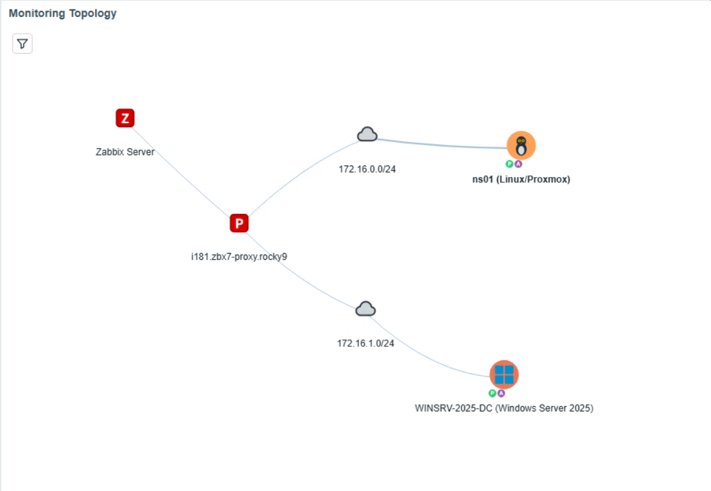
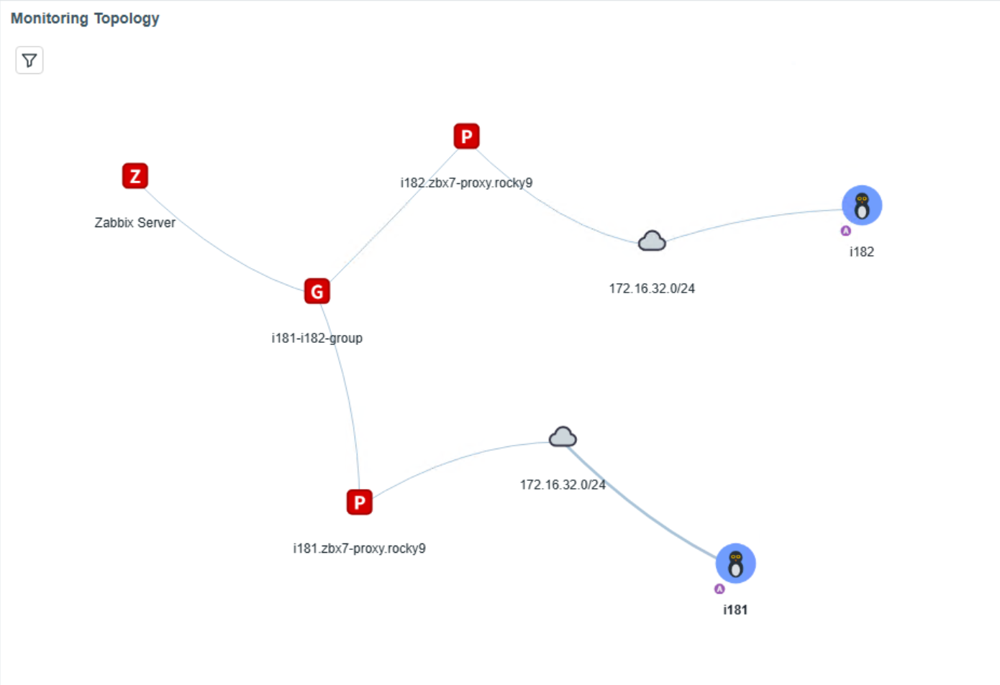
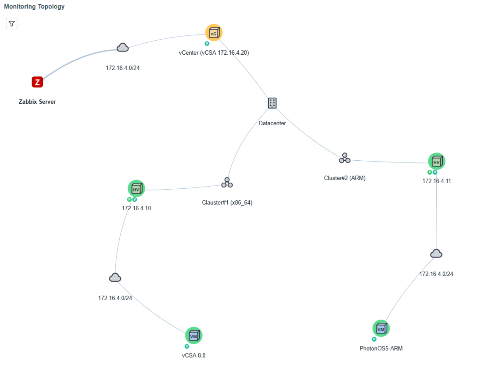

# zabbix-widget-monitoring-topology

English | [日本語](README.ja.md)

## Overview

Monitoring Topology is a dashboard widget that visualizes the monitoring paths to hosts monitored by Zabbix as a topology.

It draws a selected host or host group and visualizes Zabbix Server, Zabbix Proxy, and Proxy Group monitoring routes together with VMware virtualization and Kubernetes cluster hierarchies. It receives the target from Navigator or another compatible widget and draws the topology for the selected scope.

Vis Network renders the graph in Canvas2D; WebGL is not required.

<a href="screenshots/monitoring-topology-dashboard-example.png" target="_blank"></a>

[Latest release](https://github.com/HOLOZTEK/zabbix-widget-monitoring-topology/releases/tag/v1.1.0) | [RPM](https://github.com/HOLOZTEK/zabbix-widget-monitoring-topology/releases/download/v1.1.0/zabbix-widget-monitoring-topology-1.1.0.noarch.rpm) | [DEB](https://github.com/HOLOZTEK/zabbix-widget-monitoring-topology/releases/download/v1.1.0/zabbix-widget-monitoring-topology_1.1.0_all.deb) | [Source](https://github.com/HOLOZTEK/zabbix-widget-monitoring-topology/releases/download/v1.1.0/zabbix-widget-monitoring-topology-1.1.0.tar.gz)

## Why Monitoring Topology?

A standard dashboard can show host status, but it is not easy to see at a glance which Zabbix Server or Proxy monitors each host. Monitoring Topology draws monitoring routes from Zabbix configuration, item, and discovery relationships, making the monitoring network visible while clarifying its parent-child relationships.

It is suited to environments with many monitored hosts or advanced distributed monitoring where operators need an overview of Server/Proxy-to-host assignments, subnet placement, and VMware or Kubernetes parent-child relationships.

## Features

<table>
  <tr><th align="left" nowrap>Function</th><th align="left">Description</th></tr>
  <tr><td nowrap>Monitoring-path graph</td><td>Connects and displays Zabbix Server, Zabbix Proxy, Proxy Group, Network, and Host nodes.</td></tr>
  <tr><td nowrap>Network display</td><td>Calculates Network nodes from host interface IP addresses and a configurable IPv4 prefix length. Because monitoring-route clarity takes priority, the same network segment can appear in multiple places when it is reached through different routes.</td></tr>
  <tr><td nowrap>VMware monitoring</td><td>Uses official VMware template discovery and item data to build the Datacenter → Cluster → ESXi Host hierarchy and displays VMs through Network nodes below their ESXi Host.</td></tr>
  <tr><td nowrap>Kubernetes monitoring</td><td>Uses official Kubernetes template keys and discovery relationships to display the Network → aggregate host → Kubernetes Cluster → component host hierarchy.</td></tr>
  <tr><td nowrap>Hosts without interfaces</td><td>For monitored hosts without interfaces, derives a network or label from the connection-target macro.</td></tr>
  <tr><td nowrap>Device and monitoring-method display</td><td>Shows monitoring-method badges such as Ping, SNMP, Agent, IPMI, VMware, ODBC, JMX, and Kubernetes on host-type icons.</td></tr>
  <tr><td nowrap>Problem status display</td><td>Colors each host icon background by the highest severity among problems detected on that host.</td></tr>
  <tr><td nowrap>Display filters</td><td>Filters by problem status, host status, interface, monitoring route, and monitoring method. Host or host-group filtering requires integration with Navigator or another compatible widget.</td></tr>
  <tr><td nowrap>Widget integration</td><td>Receives host or host-group parameters from Navigator and updates the topology dynamically.</td></tr>
  <tr><td nowrap>Interactive operation</td><td>Supports moving nodes, adjusting the layout, and opening host menus.</td></tr>
</table>

## Topology Models

Monitoring Topology builds the topology from direct Zabbix Server monitoring, distributed monitoring through Zabbix Proxy, interface data, discovery relationships, host macros, and monitoring items. The actual structure depends on the data available from Zabbix.

Problem severity is displayed only for hosts. It is not displayed for groups such as Server, Proxy, Proxy Group, Network, or Cluster.

The main supported model patterns are as follows.

<table>
  <tr><th align="left" nowrap>Pattern</th><th align="left">Detection method and typical path</th><th align="left">Reference image</th></tr>
  <tr><td nowrap>Zabbix Server route</td><td><strong>Typical path:</strong> <code>Zabbix Server -&gt; Network -&gt; Host</code><br>The host is monitored directly by Zabbix Server. Its primary interface and configured subnet prefix determine the Network node.</td><td><a href="screenshots/monitoring-topology-zabbix-server.png" target="_blank"></a></td></tr>
  <tr><td nowrap>Zabbix Proxy route</td><td><strong>Typical path:</strong> <code>Zabbix Server -&gt; Zabbix Proxy -&gt; Network -&gt; Host</code><br>A host assigned to a standalone Zabbix Proxy is placed below that Proxy and its derived Network node.</td><td><a href="screenshots/monitoring-topology-zabbix-proxy.png" target="_blank"></a></td></tr>
  <tr><td nowrap>Proxy Group route</td><td><strong>Typical path:</strong> <code>Zabbix Server -&gt; Proxy Group -&gt; Zabbix Proxy -&gt; Network -&gt; Host</code><br>A host monitored through a Proxy Group is placed below the group and the member Proxy used for its route.</td><td><a href="screenshots/monitoring-topology-proxy-group.png" target="_blank"></a></td></tr>
  <tr><td nowrap>VMware monitoring</td><td><strong>Typical path:</strong> <code>Server/Proxy -&gt; Network -&gt; VMware monitoring host (Zabbix Host) -&gt; Datacenter -&gt; Cluster -&gt; ESXi Host -&gt; Network -&gt; VM</code><br>Official VMware template discovery and <code>vmware.hv.*</code> item data provide the VMware monitoring host and inventory hierarchy. Each VM is matched to its vCenter and ESXi Host, then placed below a Network node derived from the guest IP address.</td><td><a href="screenshots/monitoring-topology-vmware.png" target="_blank"></a></td></tr>
  <tr><td nowrap>Kubernetes monitoring</td><td><strong>Typical path:</strong> <code>Server/Proxy -&gt; Network -&gt; aggregate host (Zabbix Host) -&gt; Kubernetes Cluster -&gt; Kubernetes component host (Zabbix Host)</code><br>Official Kubernetes template item keys and discovery parents identify each cluster. The aggregate host is obtained automatically as the cluster parent, and component hosts such as API Server, Scheduler, Controller Manager, and Kubelet are placed by role. Multiple clusters on the same route remain separate.</td><td><a href="screenshots/monitoring-topology-kubernetes.png" target="_blank"></a></td></tr>
</table>

## Display Filters

The filter panel limits which Host nodes remain visible. Within one category, selected values are combined with OR; the five categories are combined with AND. Ancestor nodes and edges leading to matching descendant hosts remain visible so that paths are not disconnected.

<table>
        <tr><th align="left" nowrap>Category</th><th align="left">Choices</th><th align="left">Purpose and default</th></tr>
        <tr><td nowrap>Problem status</td><td>Unacknowledged, Acknowledged, No problem, Include hosts in maintenance, Colorize by severity</td><td>Filters non-maintenance hosts by problem state. Unacknowledged, Acknowledged, and No problem are enabled by default. Include hosts in maintenance is an independent visibility condition and is disabled by default. Colorize by severity affects color only and is enabled by default.</td></tr>
        <tr><td nowrap>Host status</td><td>Normal hosts, No interface configured, Local host monitoring, Disabled hosts</td><td>Partitions hosts by configuration and operational state. Only Normal hosts is enabled by default.</td></tr>
        <tr><td nowrap>Interface</td><td>Available, Mixed, Not available, Unknown</td><td>Includes hosts by interface availability. All choices are enabled by default.</td></tr>
        <tr><td nowrap>Monitoring route</td><td>Zabbix Server, Zabbix Proxy, Proxy Group</td><td>Includes hosts by their upstream monitoring route. All choices are enabled by default.</td></tr>
        <tr><td nowrap>Monitoring method</td><td>Ping, Zabbix Agent, SNMP, IPMI, JMX, Other</td><td>Includes hosts by detected monitoring method. All choices are enabled by default. Other includes VMware, ODBC, Kubernetes, and methods that cannot be classified separately.</td></tr>
</table>

<a href="screenshots/monitoring-topology-filters.png" target="_blank"></a>

Clearing every visibility choice in a category hides every host. Colorize by severity does not affect visibility. Filter state is saved per widget in the browser, and Reset restores the defaults above.

## Settings

<table>
  <tr><th align="left" nowrap>Setting</th><th align="left">Description</th></tr>
  <tr><td nowrap>Host / Host group</td><td>Receive-only connectors used to link another dashboard widget.</td></tr>
  <tr><td nowrap>Subnet prefix length</td><td>IPv4 prefix used to derive network nodes; default is 24.</td></tr>
  <tr><td nowrap>Zabbix Server label</td><td>Label displayed for the root server node.</td></tr>
  <tr><td nowrap>Font size</td><td>Node-label size from 8 to 24 pixels.</td></tr>
  <tr><td nowrap>Style</td><td>Normal, bold, or italic node labels.</td></tr>
  <tr><td nowrap>Font color</td><td>Explicit node-label color; empty uses automatic light/dark theme detection.</td></tr>
  <tr><td nowrap>Edge color</td><td>Color of graph edges.</td></tr>
  <tr><td nowrap>Edge width</td><td>Edge width from 1 to 8 pixels.</td></tr>
  <tr><td nowrap>Filter icon position</td><td>Top-left, top-right, bottom-left, or bottom-right.</td></tr>
</table>

<a href="screenshots/monitoring-topology-settings.png" target="_blank"></a>

## Dashboard Integration

This widget is receive-only and intentionally shows an empty state until a host or host group is received.

1. Add Tree Navigator or another widget that broadcasts `_hostid` or `_hostgroupid`.
2. Add Monitoring Topology to the same dashboard page.
3. In Monitoring Topology settings, connect Host and/or Host group to the source widget.
4. Select a host to show its route, or a host group to show routes for hosts in that group.

## Requirements

- Supported version: Zabbix 7.0
- Tested version: Zabbix 7.0
- PHP 8.1 or later
- Browser with Canvas2D support

## Installation

### Install from RPM

```bash
dnf install ./zabbix-widget-monitoring-topology-1.1.0.noarch.rpm
```

### Install from DEB

```bash
apt install ./zabbix-widget-monitoring-topology_1.1.0_all.deb
```

The packages install the runtime files into the active Zabbix frontend module directory. Then scan and enable the module from Administration -> Modules and add the widget to a dashboard.

### Install from Source

RPM or DEB installation is recommended. For a source installation:

```bash
curl -L -o zabbix-widget-monitoring-topology-1.1.0.tar.gz https://github.com/HOLOZTEK/zabbix-widget-monitoring-topology/releases/download/v1.1.0/zabbix-widget-monitoring-topology-1.1.0.tar.gz
tar -xzf zabbix-widget-monitoring-topology-1.1.0.tar.gz
install -d /usr/share/zabbix/ui/modules/holoztek_monitoringmap
cd zabbix-widget-monitoring-topology-1.1.0
cp -a manifest.json Module.php Widget.php actions assets includes locale views /usr/share/zabbix/ui/modules/holoztek_monitoringmap/
```

Use `/usr/share/zabbix/modules/holoztek_monitoringmap` if the installation uses the legacy frontend module path. Set readable ownership and permissions, scan modules, and enable Monitoring Topology.

## Documentation

- [CHANGELOG](docs/CHANGELOG.md)
- [CONTRIBUTING](docs/CONTRIBUTING.md)
- [SECURITY](docs/SECURITY.md)
- [Screenshot Guide](docs/screenshot-guide.md)
- [LICENSE](LICENSE)

## Repository Layout

Runtime module files remain in the repository root and under `actions/`, `assets/`, `includes/`, `locale/`, and `views/`. Packaging is under `packaging/rpm/` and `debian/`; publication and maintenance documents are under `docs/`.

## Bundled Dependency

`assets/js/vis-network.min.js` is Vis Network 10.1.0, distributed under the MIT or Apache-2.0 license as stated in its source header.

## Maintainer

Developed and maintained by [HOLOZTEK](https://github.com/HOLOZTEK).

## License

This project is licensed under the MIT License. See [LICENSE](LICENSE).
